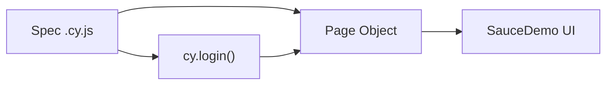

# CYSwagLabs

Testes automatizados com **Cypress** para o [SauceDemo Swag Labs](https://www.saucedemo.com), seguindo o padrão **Page Object Model (POM)** e documentação QA em `docs/`.

## Cobertura dos requisitos

| Requisito | Status | Spec | Cenários |
|-----------|--------|------|----------|
| Login (tipos de usuário) | ✅ | `login.cy.js` | standard, locked, problem, performance |
| Login negativo | ✅ | `login.cy.js` | credenciais inválidas, campos vazios, sem senha |
| Ordenação e filtragem | ✅ | `inventory.cy.js` | A–Z, Z–A, preço ↑↓ |
| Fluxo completo de compra | ✅ | `checkout.cy.js` | add → checkout → confirmação |
| Checkout negativo | ✅ | `checkout-negative.cy.js` | sem nome, sobrenome, CEP, todos vazios |
| Carrinho (add/remove) | ✅ | `cart.cy.js` | 1 item, múltiplos, remover, toggle |
| Navegação | ✅ | `navigation.cy.js` | produto, carrinho, menu, cancel |
| Logout | ✅ | `logout.cy.js` | retorno ao login |
| Responsividade | ✅ | `responsiveness.cy.js` | mobile, tablet, desktop |
| Acessibilidade | ✅ | `accessibility.cy.js` | axe em login, inventário, carrinho |
| CI/CD | ✅ | `.github/workflows/cypress.yml` | electron, chrome, firefox |
| POM | ✅ | `cypress/pages/` | Page Objects por tela |

**Suíte atual:** 9 specs · **35 testes** (última execução local: 35/35 ✅). Detalhes em [docs/test-results.md](docs/test-results.md).

## Cenários negativos

| Cenário | Mensagem / resultado | Arquivo |
|---------|----------------------|---------|
| Credenciais inválidas | `Username and password do not match` | `login.cy.js` |
| Usuário bloqueado | `Sorry, this user has been locked out` | `login.cy.js` |
| Campos de login vazios | `Username is required` | `login.cy.js` |
| Login sem senha | `Password is required` | `login.cy.js` |
| Checkout sem dados | `First Name is required` (e demais campos) | `checkout-negative.cy.js` |

Plano completo: [docs/test-plan.md](docs/test-plan.md).

## Arquitetura do projeto

```
CYSwagLabs/
├── docs/                          # Documentação QA
│   ├── test-plan.md               # Estratégia e critérios
│   ├── test-results.md            # Resultados de execução
│   ├── bugs.md                    # Defeitos conhecidos (app demo)
│   ├── risks.md                   # Riscos e mitigações
│   ├── improvements.md            # Backlog de melhorias
│   ├── accessibility.md           # A11y (axe, WCAG)
│   ├── responsiveness.md          # Viewports e limitações
│   └── evidence/README.md         # Screenshots, vídeos, CI
├── .github/workflows/
│   └── cypress.yml                # Pipeline E2E
└── saucedemo/
    ├── cypress/
    │   ├── e2e/saucedemo/         # Specs E2E
    │   ├── fixtures/users.json    # Usuários demo
    │   ├── pages/                 # Page Objects (POM)
    │   ├── support/               # commands, axe setup
    │   ├── screenshots/           # Falhas (gitignored *.png)
    │   ├── videos/                # Gravações (gitignored *.mp4)
    │   └── reports/               # JUnit XML
    ├── cypress.config.js
    └── package.json
```

### Fluxo POM



Cada Page Object expõe `elements` (seletores `data-test`) e ações (`fillCredentials`, `addToCart`, etc.), mantendo specs focados em comportamento.

## Estratégia QA

| Pilar | Implementação |
|-------|----------------|
| Regressão E2E | Cypress em PR/push para `main` |
| Dados | Fixtures + usuários oficiais da demo |
| Negativos | Validação de mensagens de erro na UI |
| A11y | cypress-axe, impacts critical/serious |
| Responsividade | 3 viewports com smoke visual |
| Evidências | Vídeo sempre; screenshot em falha; JUnit no CI |
| Riscos / bugs | [docs/risks.md](docs/risks.md), [docs/bugs.md](docs/bugs.md) |

## Evidências visuais

| Artefato | Onde |
|----------|------|
| Vídeos | `saucedemo/cypress/videos/` (gerados em `npm run cy:run`) |
| Screenshots | `saucedemo/cypress/screenshots/` (em falha) |
| Relatório CI | GitHub Actions → Artifacts (`cypress-*-videos`, `*-screenshots`, `*-report`) |

Guia: [docs/evidence/README.md](docs/evidence/README.md).

## Acessibilidade e responsividade

- **A11y:** [docs/accessibility.md](docs/accessibility.md) — axe-core, WCAG 2.x, exceções documentadas
- **Responsivo:** [docs/responsiveness.md](docs/responsiveness.md) — 375×667, 768×1024, 1280×720

## Como executar

```bash
cd saucedemo
npm install
npm run cy:open   # modo interativo
npm run cy:run    # headless (CI)
```

Spec único:

```bash
npx cypress run --spec cypress/e2e/saucedemo/login.cy.js
```

## CI/CD

O workflow [`.github/workflows/cypress.yml`](.github/workflows/cypress.yml):

- Dispara em `push` / `pull_request` na branch `main`
- Executa em **Electron, Chrome e Firefox**
- Publica JUnit, vídeos e screenshots (falha) como artefatos
- Comenta resultados no PR via `publish-unit-test-result-action`

## Riscos e melhorias

- Riscos: [docs/risks.md](docs/risks.md)
- Backlog: [docs/improvements.md](docs/improvements.md)
- Bugs da demo: [docs/bugs.md](docs/bugs.md)

## Autor

albtn9
